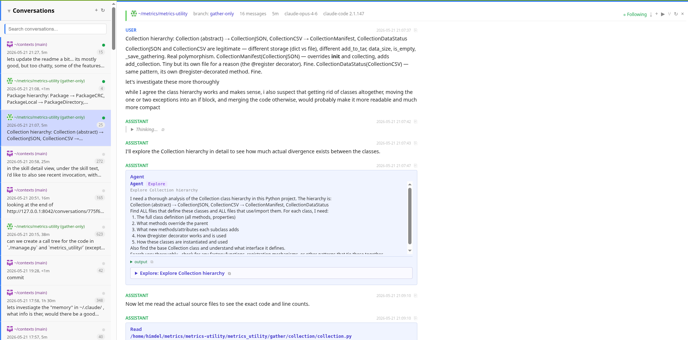
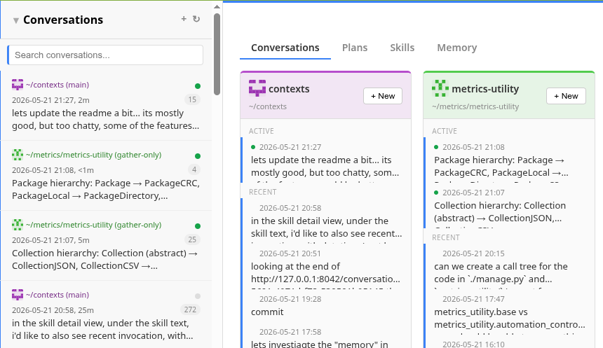
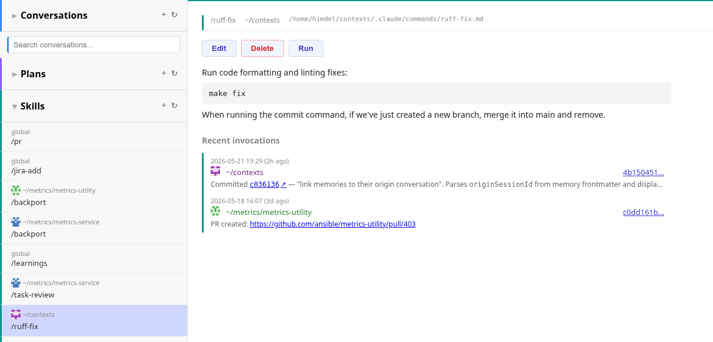
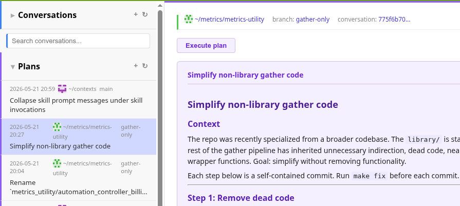
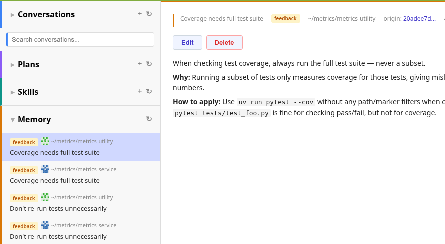
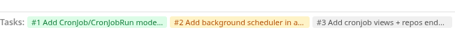

# context

Vibe-coded tool to browse Claude Code data in a web UI.

Reads `~/.claude/` and exposes conversation history, plans, skills, and memory
in a searchable, markdown-rendered interface with support for resuming, forking,
and starting new sessions.

(DO NOT expect this to be safe, secure, or complete)

## Features

### Conversations
- Full-text search with SQLite-backed index
- Markdown rendering with syntax highlighting, Mermaid diagrams
- Rich code blocks: LaTeX, Graphviz, Vega-Lite, GeoJSON, ABC notation (with audio), Markmap, PlantUML
- Tool use, thinking, subagent, and workflow blocks with inline results
- Edit blocks rendered as diffs, skill invocations collapsed under prompt
- Resume, fork, or start new sessions from the UI
- Active session indicator, status bar with running tasks and agents
- Deleted logs stay visible from DB cache, live tailing for active sessions

### Plans
- Grouped by repo, linked back to originating conversation
- Full markdown rendering with Execute button to launch a new session

### Skills
- Browse commands, skills, and saved workflows
- Create, edit, and delete with frontmatter metadata and syntax highlighting
- Open in $EDITOR, run with repo chooser, recent invocations

### Memory
- Browse, edit, and delete persistent memory items ($EDITOR support)
- MEMORY.md index with navigable links, linked to originating conversations

### Repos
- Browse CLAUDE.md files per repo (parent dirs, root, subdirs, global)
- Expandable inline preview with metadata, open in $EDITOR
- Git status: current branch, dirty files, remote tracking, ahead/behind
- Local branches with PR links, Jira issue detection, commit dates
- Worktrees listing with dirty state, terminal button, conversation links
- Fetch & Refresh, PR state lookup, branch cleanup (bulk + per-branch)
- Stale/missing repos grayed out, sorted by recent activity

### Cronjobs
- Schedule skills to run on cron with per-repo targeting
- Next run preview, manual "Run Now", run history with conversation links
- Create cronjobs directly from a skill's detail page

### Git & forge integration
- GitHub, GitLab, and Gitea/Codeberg support
- PR/MR detection for current branch, autolinks for issues and Jira references
- Clickable commit SHAs, deterministic repo icon + color tint

### Home screen
- Conversations grouped by repo with active/recent sections
- Tabs for Conversations, Plans, Skills, Cronjobs, Memory, Repos, Activity
- Activity heatmap, new session launcher, SPA with direct URL routing

## Screenshots



| Home | Skill |
|---|---|
|  |  |

| Plan | Memory |
|---|---|
|  |  |



## Usage

```
git clone https://github.com/himdel/ai-context
cd ai-context
make migrate # local sqlite file
make
```

```
open http://localhost:8042
```

Tweak `contexts/settings.py` if your terminal is not `rxvt-unicode`, X display not `:0`, etc.
