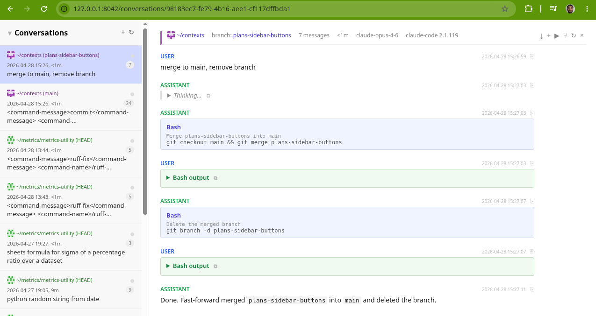

# context

vibe-coded tool to show claude conversations in a web ui

(DO NOT expect this to be safe, secure, or complete)

This reads `~/.claude/` and exposes conversation history in a nice markdown-rendered web UI,
including plans, tool uses, subagents, thinking blocks, etc.

Home screen groups conversations by repo with active/recent sections, and has tabs for Conversations, Plans, and Skills.
Each conversation gets a different visual fingerprint per repo (deterministic icon + color tint).
Direct URL routing to conversations, plans, and skills (SPA with browser history support).

For any git repos used as a base dir for a conversation, it also extracts the list of git remotes,
and enables autolinks when a github issue is mentioned. (upstream is preferred over origin, when both remotes are present)
Also detects PRs for the current branch and shows the link + status in the conversation header.
Commit SHAs in code spans are clickable - opens `git show` in a local terminal, with a GitHub link too.
Custom autolinks are configurable for Jira-style ticket references beyond GitHub #123.

Conversation header shows metadata - model, version, duration, message count, branch.
Messages have timestamps, copy-as-markdown button, and new messages highlight with a green fade animation.
Expand/collapse all button for thinking/tool blocks, scroll-to-bottom button in the toolbar.

Each conversation can be resumed/forked, and new conversations can be started - will run a new terminal with claude in that repo.

Indicators for active conversations, ability to tail -f a conversation,
auto-refresh on tab focus (after 20s), shows the number of active conversations in the favicon.

Plans can be viewed and executed from the UI (launches a new session).
Skills can be browsed, created, edited, and deleted.

---

Usage:

```
git clone https://github.com/himdel/ai-context
cd ai-context
make
```

```
open http://localhost:8042
```

Tweak `contexts/settings.py` if your terminal is not `rxvt-unicode`, X display not `:0`, etc.

---


